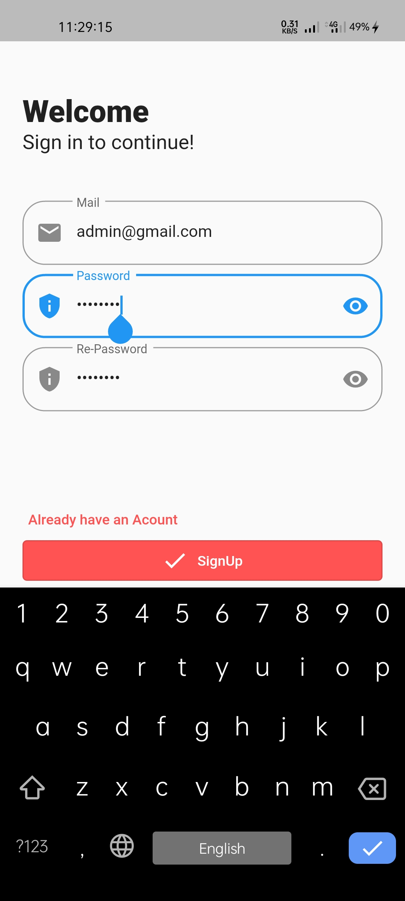
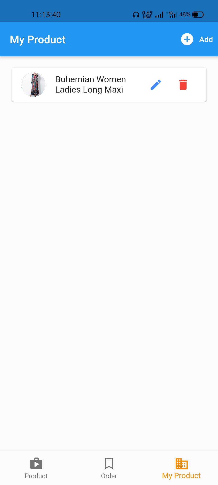
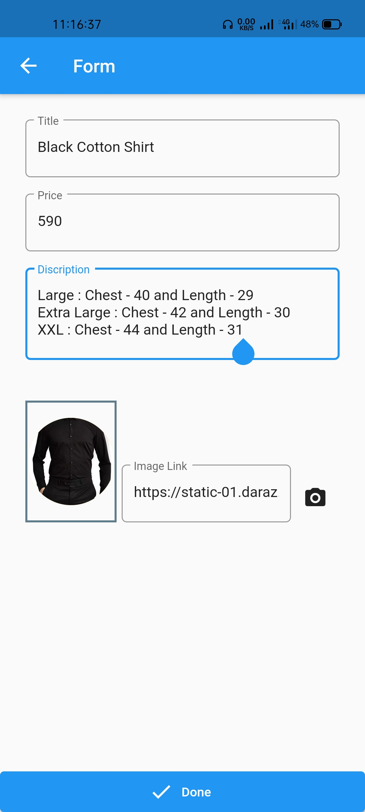

# shop_Application
Welcome to my Shop application.In this project i used,
1. Firebase restApi
2. firebase database
3. Firebase Authentication
4. Provider for state management
5. Sharedpreferences for store token data localy

<!DOCTYPE html>
<html>
<body>

1. Create new User

2. User Login. After log in , it will auto login when open this applicaion

3. All shop item can see every user

4. Switch to  Favorit item. Only user can add and show favorit

5. Fovorit item

6. Product Details page

7. Shop Cart screen

8. Order Screen

9. User can show order details

10. User only Product

12. Add product

13. After added Product only user can see from My Product section, as a admin. Admin can Edit and delete that products

14. Other User Product Screen. All the products are available in Product section. Every user can order or make favorit from there 

</body>
</html>
